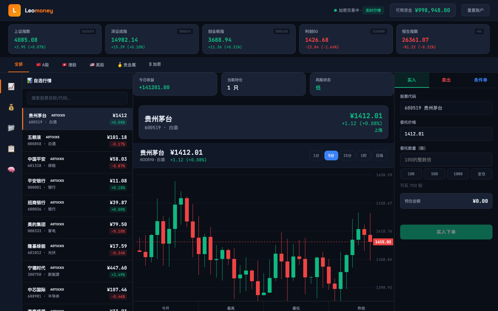

# LeoMoney

LeoMoney 是一套面向个人投资者和量化研究者的 AI-Native 模拟交易系统。当前版本已经升级为中文交易指挥舱，覆盖实时行情、K 线、模拟交易、多账户、Agent 风控、自动化执行闸门、审计日志和决策回放。

> 重要提示：本项目用于模拟交易、策略研究和自动化实验，不构成投资建议，也不应直接替代真实交易风控。



## 当前版本

- 版本：`v3.0.0`，当前 main 为 `v3.0.0-vnext` 准上线版
- 默认端口：`3210`
- 主入口：`server.js`
- 前端入口：`public/index.html`
- 数据目录：`data/`，已加入 `.gitignore`
- 支持市场：A 股、港股、美股、贵金属、加密资产、主要指数

## 核心能力

- 中文交易终端：深色高信息密度界面，左侧专业导航，顶部账户与风控状态，主区行情/K 线/持仓/交易，右侧 Agent 与审计流。
- 实时行情：聚合新浪财经、东方财富等免费数据源，支持指数、A 股、港股、美股、贵金属和加密资产。
- 专业 K 线：新增 `/api/kline/:symbol` 接口，优先拉取新浪分钟线，失败时使用可审计的降级数据。
- 多账户系统：账户之间资金、持仓、订单、统计相互隔离，支持切换、创建、归档和重置。
- 模拟交易内核：买入、卖出、冻结资金、冻结持仓、部分成交、订单状态机、FIFO 成本、持仓盈亏。
- Agent 自动化总线：手动触发、条件触发、计划任务、Agent 信号、回测事件都进入统一自动化流水线。
- ExecutionGate 执行闸门：LLM 或规则不能直接下单，必须通过 Schema、规则、熔断器、风控、审计后才可执行。
- 审计与回放：每次自动化运行都会写入审计事件，可通过 runId 回放触发、上下文、决策、风控和执行结果。
- SSE 实时推送：行情、Agent、交易通知和系统状态可实时推送到前端。
- 安全降级：LLM 不可用、行情异常、风控拒绝、熔断开启时自动进入 HOLD 或 dry-run 状态。

## 快速启动

```bash
npm install
npm start
```

打开：

```text
http://localhost:3210
```

健康检查：

```bash
curl http://localhost:3210/api/health
```

行情检查：

```bash
curl http://localhost:3210/api/quotes
curl "http://localhost:3210/api/kline/sh000001?scale=5&limit=80"
```

## 常用脚本

```bash
npm start              # 启动 Web 服务
npm run dev            # 同 npm start
npm run check          # 语法检查 + 后端领域测试
npm run find:mojibake  # 扫描乱码文案
node cli.js --help     # 查看 CLI 能力
```

## Agent 配置

Agent 能力需要配置 LLM API Key。没有配置时，系统仍可运行交易终端、行情、模拟交易、审计和规则自动化；LLM 相关能力会显示为未就绪。

```bash
# Windows
set LLM_PROVIDER=deepseek
set LLM_API_KEY=your-api-key
set LLM_MODEL=deepseek-chat
npm start

# Linux/macOS
export LLM_PROVIDER=deepseek
export LLM_API_KEY=your-api-key
npm start
```

也可以使用 OpenAI：

```bash
set LLM_PROVIDER=openai
set LLM_API_KEY=sk-your-key
npm start
```

## 自动化执行链路

LeoMoney VNext 的自动化不允许绕过交易内核。所有自动决策都走同一条流水线：

```text
Trigger
  -> ContextBuilder
  -> RuleEngine / AgentDecision
  -> DecisionSchema
  -> ExecutionGate
  -> RiskManager
  -> CircuitBreaker
  -> TradingService
  -> AuditLog
  -> Replay
```

执行模式：

| 模式 | 说明 |
| --- | --- |
| `dry_run` | 只生成方案、风控和审计，不真实写入交易 |
| `paper_execution` | 通过风控后执行模拟交易 |

示例：

```bash
curl -X POST http://localhost:3210/api/automation/run \
  -H "Content-Type: application/json" \
  -d "{\"symbol\":\"600519\",\"mode\":\"dry_run\"}"
```

查看审计：

```bash
curl "http://localhost:3210/api/audit/events?limit=20"
curl "http://localhost:3210/api/replay/run_xxx"
```

## 主要 API

### 系统

| 接口 | 方法 | 说明 |
| --- | --- | --- |
| `/api/health` | GET | 系统健康、市场状态、Agent、风控、SSE、审计状态 |
| `/api/vnext/status` | GET | VNext 能力清单 |

### 行情

| 接口 | 方法 | 说明 |
| --- | --- | --- |
| `/api/quotes` | GET | 全市场行情 |
| `/api/quote/:symbol` | GET | 单资产行情 |
| `/api/search?q=茅台` | GET | 搜索资产 |
| `/api/kline/:symbol` | GET | K 线数据，支持 `scale` 和 `limit` |

### 账户与交易

| 接口 | 方法 | 说明 |
| --- | --- | --- |
| `/api/accounts` | GET/POST | 账户列表、创建账户 |
| `/api/accounts/:id/switch` | POST | 切换账户 |
| `/api/account` | GET | 当前账户资产、持仓、订单 |
| `/api/buy` | POST | 模拟买入 |
| `/api/sell` | POST | 模拟卖出 |
| `/api/orders` | GET | 订单列表 |

### Agent 与风控

| 接口 | 方法 | 说明 |
| --- | --- | --- |
| `/api/agent/status` | GET | Agent 运行状态 |
| `/api/agent/config` | GET/PATCH | Agent 配置 |
| `/api/agent/signal` | POST | 生成 Agent 信号 |
| `/api/agent/proposals` | GET | 交易方案 |
| `/api/agent/circuit-breaker` | GET | 熔断器状态 |
| `/api/agent/risk` | GET/PATCH | 风控参数 |

### 自动化与审计

| 接口 | 方法 | 说明 |
| --- | --- | --- |
| `/api/automation/run` | POST | 触发自动化流水线 |
| `/api/audit/events` | GET | 审计事件列表 |
| `/api/replay/:runId` | GET | 自动化运行回放 |

## 项目结构

```text
leomoney/
├─ server.js                         # Express 服务入口
├─ cli.js                            # 命令行工具
├─ lib/
│  ├─ quotes.js                      # 行情数据源
│  ├─ market.js                      # 市场状态
│  ├─ trading.js                     # 兼容交易入口
│  ├─ scheduler.js                   # 后台调度
│  └─ agent/                         # Agent、熔断器、风控、信号
├─ public/
│  └─ index.html                     # 中文交易指挥舱
├─ scripts/
│  └─ find-mojibake.js               # 乱码扫描
├─ src/
│  ├─ analytics/                     # 指标、持仓、交易分析
│  └─ server/
│     ├─ audit/                      # 审计日志与回放
│     ├─ automation/                 # 自动化总线与执行闸门
│     ├─ domain/                     # 金额、订单、事件、账户领域模型
│     ├─ repositories/               # JSON 原子持久化
│     ├─ routes/                     # API 路由
│     └─ services/                   # 账户、交易、订单、结算、风控服务
└─ data/                             # 运行时数据，不提交 Git
```

## 测试与验证

```bash
npm run check
```

当前远端 main 已验证：

- 依赖安装成功
- `npm audit` 0 个漏洞
- 语法检查通过
- 后端领域测试 48/48 通过
- `/api/health` 返回 200
- `/api/quotes` 返回 39 个资产
- `/api/kline/sh000001?scale=5&limit=80` 返回 240 个 K 线点

## 部署建议

```bash
git clone https://github.com/leoyb1010/leomoney.git
cd leomoney
npm ci
PORT=3210 npm start
```

生产环境建议：

- 使用 PM2、systemd 或 Docker 守护进程运行。
- 将 `data/` 放到持久化磁盘。
- 配置反向代理，例如 Nginx/Caddy。
- 为公网启用 HTTPS。
- 为 Agent API Key 使用环境变量，不要写入仓库。

## 下一阶段路线

- SQLite WAL 数据层，替代 JSON 主存储。
- React/TypeScript 前端拆分，保留当前中文指挥舱体验。
- Agent DAG：Observe、Analyze、Critic、RiskOfficer、Proposal、ExecutionGate、MemoryWrite。
- 事件驱动回测：手续费、滑点、T+1、涨跌停、冻结资金、成交失败。
- 交易时光机：对任意 runId 回放完整市场上下文与 Agent 决策链。

## 版本更新记录

### v3.0.0-vnext — 2026-04-29 — 准上线中文交易指挥舱

本次更新是当前 main 分支的实际准上线版本，重点解决“能不能拿来测试上线”的问题。

- 重做首页为中文交易指挥舱，移除大面积英文和原始 JSON 展示，核心信息改为中文状态、中文按钮、中文审计摘要。
- 升级 UI 视觉：深色金融终端、高信息密度布局、左侧品牌导航、顶部账户/风控/市场状态、右侧 Agent 与审计流。
- 修复账户管理入口，新增账户抽屉交互，支持查看账户、切换账户、创建账户、重置账户等操作入口。
- 强化响应式适配，覆盖桌面、平板、折叠屏和手机宽度，减少横向溢出和文字压住背景的问题。
- 新增 `/api/health` 系统健康接口，展示市场、API、Agent、风控、SSE、审计目录等运行状态。
- 新增 `/api/kline/:symbol` K 线接口，支持指数和个股，优先使用新浪分钟线，失败时返回可审计降级数据。
- 修复大盘指数点击后“未找到资产”的问题，指数也进入统一资产查询和 K 线链路。
- 新增自动化总线 `src/server/automation/`，将手动触发、规则触发、Agent 触发、回测触发统一进入同一套 pipeline。
- 新增 `ExecutionGate` 执行闸门，自动化决策必须经过 Schema、规则、风控、熔断器、审计后才能执行。
- 新增审计日志 `src/server/audit/auditLog.js`，每次自动化运行记录 trigger、context、decision、gate、result。
- 新增 `/api/automation/run`、`/api/audit/events`、`/api/replay/:runId`，支持自动化测试、审计查看和运行回放。
- 交易记录支持写入 meta 信息，自动化来源、runId、风控批准状态可以进入交易链路。
- 事件总线增加序号和稳定排序，订单生命周期追踪更可靠。
- 新增 `scripts/find-mojibake.js`，用于扫描 README、HTML、CSS、JS、JSON 中的乱码文案。
- 引入 `zod`，用于自动化触发和决策结构校验，避免 LLM 或规则输出越权执行。
- 验证结果：远端重新克隆后 `npm ci` 成功，语法检查通过，后端领域测试 48/48 通过。
- API 实测结果：`/api/health` 返回 200，`/api/quotes` 返回 39 个资产，`/api/kline/sh000001?scale=5&limit=80` 返回 240 个 K 线点。

### v3.0.0 — 2026-04-26 — 可靠性、专业 UX、智能化整合

- 熔断器升级为 v3，支持 `CLOSED -> OPEN -> HALF_OPEN` 状态机、冷却恢复和自动降级。
- 风控引擎升级为 v3，基于真实持仓浮盈浮亏触发动态止损、移动止损和集中度检查。
- LLM Brain 增加 Schema 校验和失败重试，非法 JSON、非法动作、置信度异常时安全降级为 HOLD。
- StateRepository 增强写入校验、JSON 解析验证、启动完整性检查和 currentAccountId 自动修正。
- API 容灾增强，增加延迟追踪、可用率统计、慢请求标记和降级跳过机制。
- 视觉系统统一红涨绿跌，修正买入/卖出、涨跌色彩语义，符合中国 A 股使用习惯。
- CSS token、组件层、应用层统一升级，增加指标卡 hover、玻璃态通知、骨架屏和焦点态。
- SSE 实时推送升级，支持行情、Agent 信号、交易通知、系统状态和熔断器事件。
- Agent 认知闭环拆分为 Observation、Analysis、Decision、Execution 四阶段，并支持阶段广播。
- 多策略回测补充胜率、盈亏比、最大回撤、夏普比率、利润因子等指标。
- API 健康面板展示 API 状态、延迟、可用率、SSE 连接数和 LLM 配置情况。

### v2.0.1 — 2026-04-25 — v2 修复补丁

- 修复 K 线区域高度过大导致页面撑爆的问题，限制为 380px 和最大 45vh。
- 默认 LLM 模型切换到 `deepseek-v4-pro`。
- 修复 Agent 自动交易相关 API 未注册导致 404 的问题。
- Agent 配置持久化到 `state.json`。
- 无持仓、无自选时使用热门标的兜底扫描。
- Agent 扫描间隔从 300 秒优化为 60 秒。

### v2.0.0 — 2026-04-24 — 视觉与工程大升级

- 引入专业 K 线体验，替换原 Canvas 自绘方案，支持十字线、缩放、拖拽、多周期切换。
- Dashboard 新增资产净值曲线，支持 7 天、30 天、90 天、全部周期。
- 新增持仓分布可视化，包括环形饼图和盈亏横向条形图。
- Agent 控制台重构为状态卡片、指标卡、信号时间轴和交易方案卡。
- Header 升级为玻璃态视觉，按钮、指标卡、侧边栏增加 hover 和发光反馈。
- 移动端适配增强，侧边栏在小屏下转为底部 Tab Bar，弹窗和 KPI 自动重排。
- 数据持久化引入原子写入，先写临时文件再替换正式文件，降低崩溃导致数据损坏的风险。
- 增加 3 级自动备份，写入前轮转 backup.1、backup.2、backup.3。
- 启动时检查 `state.json` 完整性，损坏时尝试从备份恢复。
- 行情 API 增加多源容灾，连续失败后降级，冷却后恢复尝试。

### v1.9.0 — 2026-04-24 — 上线前安全与架构加固

- 测试基线从 `console.assert` 改为 `node:test` 和 `node:assert/strict`，失败时返回非零退出码。
- 移除硬编码 `rejectUnauthorized: false`，改为由 `TLS_REJECT_UNAUTHORIZED` 环境变量控制，默认启用 TLS 校验。
- `analyzeSingle()` 改成只读分析，不再在分析阶段执行交易。
- 熔断器记录真实 `pnl` 和 `pnlPct`，单笔亏损和日亏损保护真正生效。
- 日亏损只累计亏损，盈利不再错误抵消风控亏损。
- 风控计数同时覆盖成功和失败交易。
- SELL 方案数量基于 `sellableQty`，不再错误使用可用现金。
- 多账户隔离从全局单例升级为 `Map<accountId, instance>`，避免账户之间状态串扰。
- Scheduler 监听器去重，防止重启后重复监听和重复执行。

### v1.8.0 — 2026-04-24 — 五阶段交易正确性重构

- Phase 1：新增 Decimal 金额计算、订单状态机、现金冻结、持仓冻结、撤单释放、结算失败回滚。
- Phase 1：条件单创建即冻结资源，触发时只做状态流转；旧账户自动迁移为 cash/positions 新结构。
- Phase 2：新增 ObservationBuilder，统一构建行情、账户、持仓、订单、风控、时段快照。
- Phase 2：Agent 输出增加严格 Schema 解析，非法 JSON、非法字段、非法动作统一降级。
- Phase 2：新增 Agent 审计链，记录 observation、prompt、raw、parsed、risk、execution。
- Phase 3：新增硬风控服务，覆盖单笔限额、仓位、日累计、禁买名单、价格跳变、空值保护等检查。
- Phase 3：持仓成本改为 FIFO 算法，超卖直接报错；最大回撤基于权益曲线计算。
- Phase 4：新增事件总线、撮合服务、结算服务和回测时间语义约束。
- Phase 5：前端展示可用/冻结/总资金、总数/可卖/冻结持仓、手续费和预冻结金额估算。

### v1.7.0 — 2026-04-23 — Agent 自动交易系统上线

- 新增 Agent 熔断器，支持三态状态机、自动降级和事件通知。
- 新增 Agent 风控引擎，覆盖单笔仓位、总仓位、日亏损、交易时段、自动止损止盈。
- 新增 5 个策略模板：保守、均衡、激进、动量、事件驱动。
- 新增自定义 Prompt 支持，可注入实时行情、新闻和持仓数据。
- 新增信号引擎，串联信息采集、LLM 分析、信号生成、交易方案和执行。
- Scheduler 升级为三层调度：条件单检查、信号扫描、熔断监控。
- 后端新增 Agent 配置、策略、信号、方案、熔断、风控、日报等 API。
- 前端新增 Agent 控制台入口，包含配置面板、信号流、方案卡、日志和安全控制。
- 定义 L1 监控者、L2 顾问者、L3 代理者三级安全模式。

### v1.6.1 — 2026-04-23 — 交易核心修补与数据一致性收口

- 修复条件单创建接口字段语义，严格区分 `type=buy|sell` 和 `triggerType=gte|lte`。
- 条件单服务增加输入校验，拒绝无效订单类型、触发条件、价格和数量。
- 条件单执行兼容 `.SS`、`.HK`、`.US` 后缀 symbol，避免代码格式不同导致无法触发。
- 账户查询统一过滤 archived 账户，避免已删除账户继续参与切换和读取。
- 账户写操作改为串行 state transaction，降低 JSON 并发覆盖风险。
- `todayRealizedPnL` 改为复用成交盈亏明细计算，不再错误读取当前剩余持仓均价。
- 服务启动日志读取 `package.json` 版本，避免运行版本和 README/package 不一致。
- 移除行情请求中的不安全 TLS 配置。

### v1.6.0 — 2026-04-22 — 后端分层、Dashboard、订单管理页

- `server.js` 重构为轻路由层，业务逻辑迁移到 services。
- `trading.js` 拆分为 accountService、tradingService、orderService、watchlistService、summaryService。
- `stateRepository` 统一承担持久化职责。
- 前端拆分为 `main.js` 统一入口和 features 功能模块，`app.js` 退化为兼容壳。
- `index.html` 移除内联事件，改为 JS 事件委托。
- 新增 Dashboard 总览页，包含 KPI、市场动态、关注标的、最近成交。
- 新增独立订单管理页，展示条件单统计、生命周期管理和取消功能。
- 侧边栏重整为总览、市场、交易、资产、订单、复盘。
- 修复条件单 API 参数名兼容问题，修复 symbol 后缀归一化，切换账户后同步刷新 Dashboard 和 Orders。

### v1.5.0 — 2026-04-22 — 多账户平台化

- 底层存储从单账户 state 升级为 accounts 容器模型。
- 旧版单账户 `state.json` 自动迁移为默认账户。
- 新增账户管理 API：获取、创建、更新、删除、切换账户。
- buy、sell、createOrder、getWatchlist 等业务函数改为基于 currentAccountId 操作。
- 条件单检查改为遍历所有账户独立触发，执行结果落回对应账户。
- 重置账户只影响当前账户，不再全局重置。
- 前端新增账户切换下拉，支持切换、新建、删除和颜色标记。
- 新增账户创建弹窗和删除确认弹窗。
- 切换账户后全站资金、持仓、自选、条件单、复盘同步刷新。

### v1.4.0 — 2026-04-22 — 自选、市场状态、交易规则、汇率感知

- 新增自选系统，支持 watchlist CRUD、热门/自选切换、当前标的加入自选、空状态。
- 新增汇率层 `lib/fx.js`，支持多市场资产折算人民币口径。
- 新增 `/api/fx` 和 `/api/account/summary`。
- 多市场交易规则按品类定义步进、单位和交易限制。
- 市场状态可视化，自动识别交易时段和休市冻结提示。
- 建立统一设计 token 体系和基础组件样式库。
- 前端拆分为 core、utils、adapters、presenters、features 等模块。
- 修复持仓统计口径不一致问题。
- 增加 data-testid、data-role、data-symbol，提升 Agent 和测试友好度。

### v1.2.0 — 2026-04-21 — 交易分析与 Agent 决策层

- 新增 `src/analytics/` 分析层，包含 position、metrics、tradeEngine。
- 新增 FIFO 成本持仓计算和已实现盈亏明细。
- 新增交易指标：胜率、盈亏比、最大回撤、平均盈亏、按策略统计。
- 新增结构化 Agent 提示词、决策输入生成和统一 JSON 输出格式。
- 新增 `/api/analysis`、`/api/agent/prompt`、`/api/agent/decision-input`。
- 前端新增“分析”页面。

### v1.1.0 — 2026-04-21 — K 线交互、条件单、全市场搜索

- 新增 K 线 Canvas 绘制、鼠标悬停十字线和数据浮框。
- 新增条件单功能，支持按价格大于等于、小于等于触发自动买卖。
- 接入东方财富全市场搜索，支持股票、基金、ETF 等品种检索。
- 新增市场状态自动检测。

### v1.0.0 — 2026-04-21 — 初始版本

- 建立 Node.js + Express 后端和原生 HTML/CSS/JS 前端。
- 接入新浪财经和东方财富免费数据源。
- 支持基础行情、模拟买入、模拟卖出、持仓管理和 K 线展示。
- 提供 CLI 命令行工具。
- 使用 JSON 文件进行轻量持久化。

## License

当前仓库未声明开源许可证。对外开源或商业化前建议补充明确 License。
